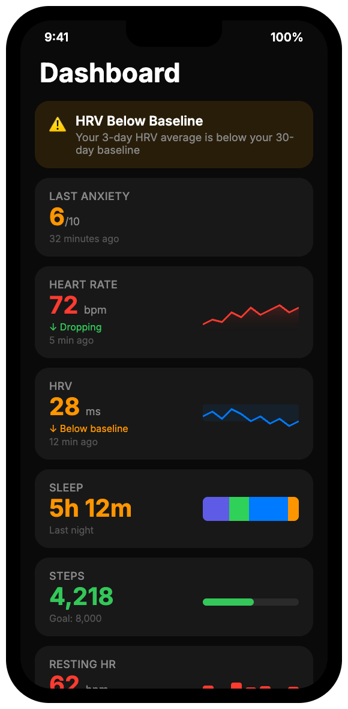
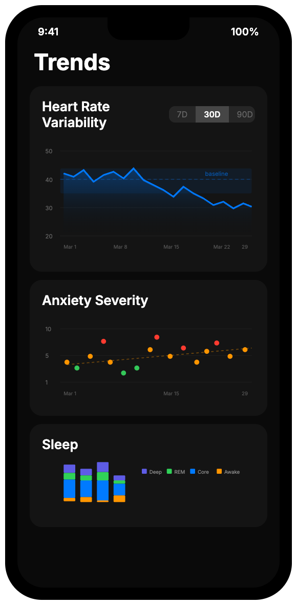
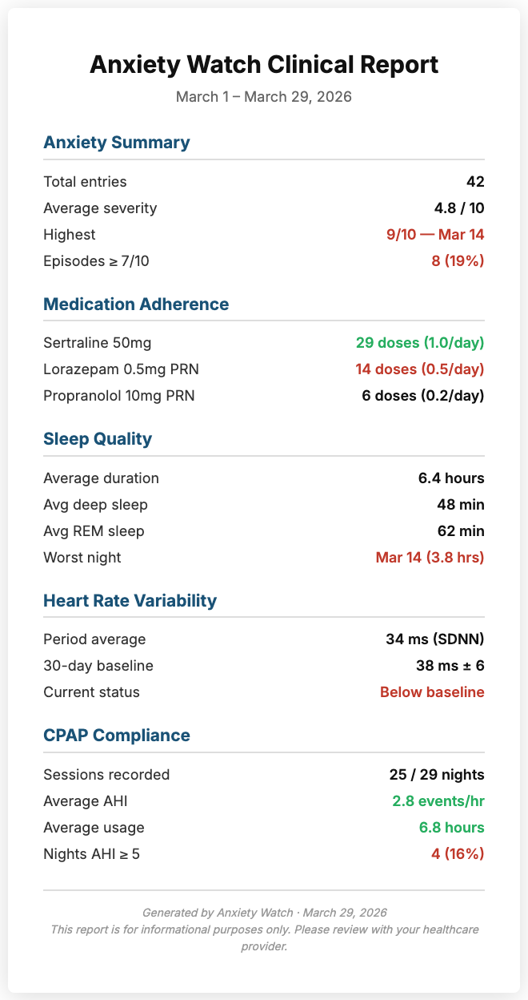
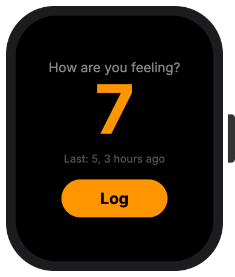
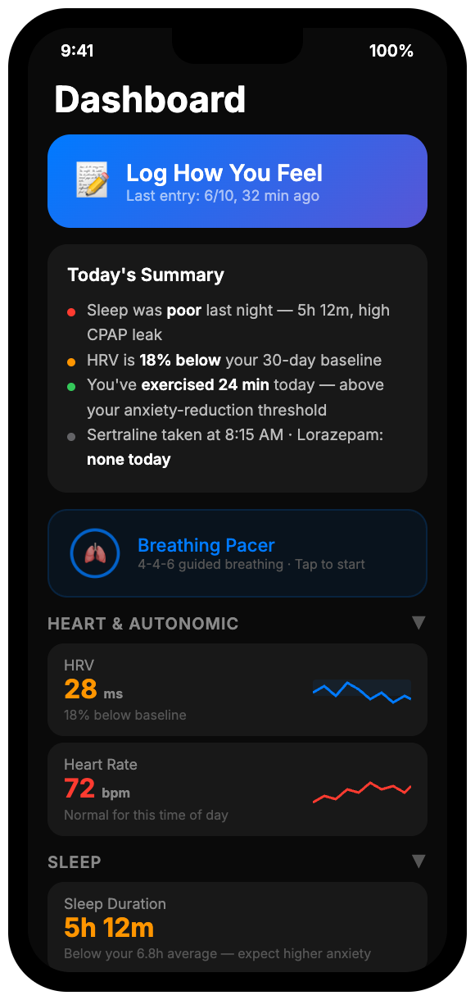
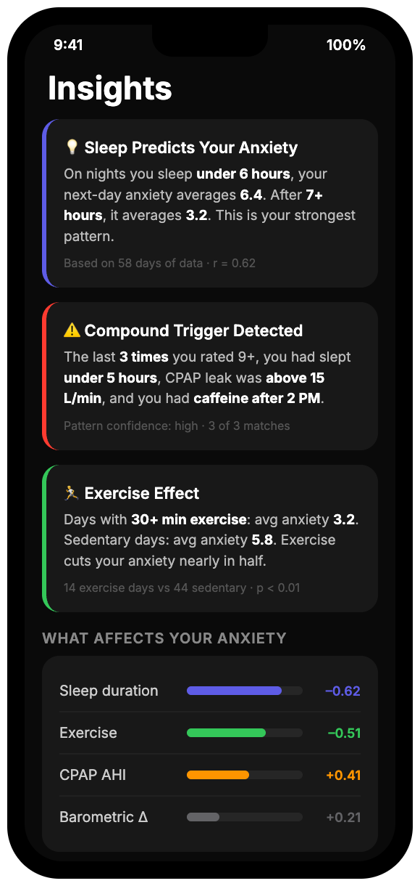
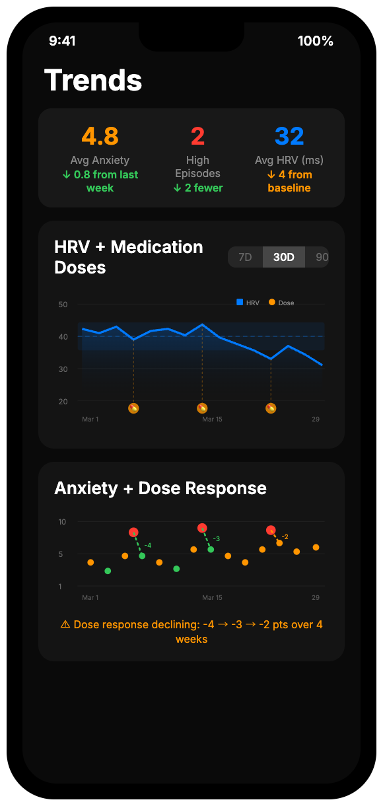

<div align="center">

# Anxiety Watch

*Your experience and your physiology, together.*

[](https://swift.org)
[](https://developer.apple.com/ios/)
[]()
[]()
[](LICENSE)

</div>

You slept five hours. Your CPAP leaked. Your heart rate variability dropped below your personal baseline overnight. You already feel the anxiety creeping in before your feet hit the floor — but this morning, you know *why*.

Anxiety Watch is an iOS and watchOS app that tracks anxiety from both sides: the severity you report and the physiology your Apple Watch records. It logs your medication doses and measures whether they actually helped. It imports your CPAP data and connects sleep apnea treatment to next-day anxiety. Over weeks and months, it builds a picture of your anxiety that no single journal entry or doctor's appointment could capture alone — and generates clinical reports that turn a fifteen-minute psychiatrist visit into a data-informed conversation.

The result is not a wall of numbers. It is your own data, interpreted through your own history, making the invisible patterns visible. Anxiety is less frightening when it is less mysterious.

> **Your data never leaves your devices.** There is no cloud service, no account to create, no telemetry, no analytics. Health data stays in HealthKit on your iPhone. App data stays in local SwiftData storage. The only time data goes anywhere is when *you* explicitly choose to export a report, sync to *your own* self-hosted server, or share a clinical PDF with *your* doctor. You are in complete control.

> **This project is under active development.** The data collection layer is thorough — 25+ HealthKit data types, medication tracking with efficacy measurement, OSCAR CSV import with server-side EDF leak parsing, pharmacy benefit (CapRx) integration, clinical reports, a sync server, and a growing test suite. The first piece of the intelligence layer is live: a physiological correlation engine that identifies which health metrics most influence your anxiety. Compound triggers, proactive insights, and morning briefings are where the project is headed next.

<div align="center">
  
  &nbsp;&nbsp;
  
  &nbsp;&nbsp;
  
  &nbsp;&nbsp;
  
</div>

---

## Why This Exists

The fifteen-minute psychiatrist appointment is one of medicine's cruelest constraints. *How have you been sleeping? Is the medication helping? Are things getting better or worse?* You answer with impressions colored by however you feel right now. Your doctor adjusts treatment based on those impressions. Everyone does their best with fragments of memory.

Anxiety Watch replaces impressions with evidence. Not because data is more "true" than your experience — it isn't — but because your experience and your physiology together tell a fuller story than either one alone. When you walk into that appointment with a clinical summary showing that your PRN medication usage is up, its efficacy is down, and sleep quality is the strongest predictor of your next-day anxiety, the conversation changes. It becomes specific. It becomes actionable.

This started as a personal tool built by someone who lives with anxiety and panic disorder. It is becoming open-source because the approach — combining what you feel with what your body measures — could help others in the same situation. It is not a commercial product. There are no engagement metrics, no subscription, no telemetry. Every feature exists because a real person needed it.

### A note about self-monitoring

For some people, tracking health data can increase anxiety rather than reduce it. If monitoring your own physiological metrics makes you feel worse, this tool may not be right for you — and that is completely okay. Anxiety Watch is designed to show you what numbers *mean for you* (e.g., "18% below your baseline, consistent with post-bad-sleep patterns") rather than raw values that invite catastrophic interpretation. But self-monitoring is not for everyone, and this app is not a substitute for working with a mental health professional.

> **If you are in crisis:** Contact the [988 Suicide & Crisis Lifeline](https://988lifeline.org/) (call or text 988) or your local emergency services. This app is not a crisis intervention tool.

---

## What It Tracks

| Feature | What It Does |
|---------|-------------|
| **Anxiety journal** | Severity (1-10) via color-coded tappable circles, notes, tags — with an express mode that saves in a single tap. Timestamped entries anchor all physiological data |
| **Medication tracking** | Dose logging with 30-min before/after efficacy follow-up (a personal [N-of-1 trial](https://en.wikipedia.org/wiki/N-of-1_trial)) |
| **watchOS Quick Log** | Color-coded severity circles in a tappable grid — works during panic, under five seconds |
| **Random check-ins** | Configurable push notifications at random times during waking hours prompt you to log your mood — captures data points you'd otherwise miss |
| **Physiological insights** | Correlation engine that identifies which health metrics (HRV, sleep, steps, CPAP, barometric pressure) most influence your anxiety, with scatter plots and per-metric breakdowns |
| **HealthKit integration** | 25+ data types (HRV, sleep stages, heart rate, SpO2, activity, blood pressure, walking metrics, daylight exposure, physical effort, AFib burden, and more) with personal rolling baselines |
| **CPAP import** | AirSense 11 SD card — AHI, leak rates, usage hours via on-device OSCAR CSV auto-detection; self-hosted sync server parses EDF files for leak rate percentiles; CPAP metrics feed into daily health snapshots and the correlation engine |
| **Prescription management** | Supply tracking, refill alerts, OCR label scanning, pharmacy search with call logging, CapRx pharmacy benefit claim import |
| **Clinical reports** | PDF summaries structured for psychiatric appointments — anxiety, meds, sleep, HRV, CPAP, labs |
| **Data export** | JSON/CSV across 10 entity types, plus self-hosted Flask + PostgreSQL sync server |

All health data stays on your device. No cloud service, no third-party SDKs, no analytics, no telemetry. See [docs/FEATURES.md](docs/FEATURES.md) for the full breakdown of every data source, the HealthKit data types table, and how personal baselines work.

---

## What Makes This Different

Most anxiety apps are journals. Some add meditation. A few track mood over time. None of them do this:

### Quantified medication efficacy

The dose-triggered anxiety prompt with 30-minute follow-up produces paired before/after measurements for every dose. Over weeks, this builds a personal efficacy curve per medication. When that curve flattens — tolerance — it becomes visible in the data before you or your clinician would notice through recall alone. No consumer anxiety app tracks this. Most clinical trials don't measure it at this frequency for an individual patient.

### Sleep-apnea-anxiety pipeline

CPAP data integrated with sleep quality metrics and next-day anxiety ratings. The CPAP importer auto-detects OSCAR Summary CSV exports, and the sync server parses EDF waveform files from the SD card to extract detailed leak rate percentiles. No anxiety app tracks CPAP compliance. No CPAP app tracks anxiety. For the millions of people who have both sleep apnea and an anxiety disorder, this connection has been invisible.

### Personal baselines over population norms

"Your HRV is 18% below your 30-day average" is actionable. "Your HRV is 34ms" is noise. The app computes your rolling personal baselines and flags *your* deviations from *your* normal.

### Designed for your worst moments

The watchOS Quick Log uses large, color-coded tappable circles because fine motor control is unreliable during panic — no scrolling, no precision, just tap the number that matches how you feel. "Last taken" timestamps prevent the terrifying uncertainty of double-dosing during acute anxiety. The future "This Too Shall Pass" view will show your own history of panic episodes resolving — evidence from your own life that it always ends.

### Export-first, not walled-garden

Every piece of data is exportable — JSON, CSV, or clinical PDF — from day one. The Claude analysis workflow leverages the best available AI for pattern detection rather than building a mediocre ML system into the app.

---

## The Road Ahead

The data collection layer is solid, and the first piece of the intelligence layer is live — a physiological correlation engine that identifies which health metrics most influence your anxiety, with per-metric breakdowns and scatter plots. Random check-ins capture mood at unprompted moments, filling gaps that voluntary journaling misses. Next: compound trigger identification (when bad sleep *plus* high barometric pressure shift predicts a bad day), medication efficacy trend detection, and proactive morning briefings that demystify bad days before they spiral.

<div align="center">
  
  &nbsp;&nbsp;
  
  &nbsp;&nbsp;
  
</div>

*Design mockups — a dashboard that tells stories instead of dumping numbers, an intelligence layer that surfaces personal patterns, and trend charts with medication dose markers that make tolerance visible.*

See [PROJECT_FUTURE_PLAN.md](PROJECT_FUTURE_PLAN.md) for the full phased roadmap, North Star vision, and current status by phase.

---

## Architecture

```
┌─────────────────────────────────────────────────────┐
│                     SwiftUI Views                    │
│   Views across Dashboard, Journal, Medications,      │
│   Trends (7 charts), Prescriptions, Pharmacy,        │
│   CPAP, Lab Results, Reports, Settings               │
├─────────────────────────────────────────────────────┤
│                      Services                        │
│   HealthKitManager (actor) · HealthDataCoordinator   │
│   SnapshotAggregator · BaselineCalculator            │
│   CPAPImporter · ReportGenerator · DataExporter      │
│   SyncService · PrescriptionLabelScanner · ...       │
├────────────────────┬────────────────────────────────┤
│     HealthKit      │       SwiftData (local)         │
│  25+ data types    │  11 @Model classes: journal,    │
│  Actor-isolated    │  meds, Rx, CPAP, snapshots,     │
│  Anchored queries  │  health samples, barometric,    │
│  Background sync   │  lab results, pharmacy          │
├────────────────────┼────────────────────────────────┤
│   Core Motion      │    Flask + PostgreSQL           │
│   (barometer)      │    (self-hosted sync server)    │
└────────────────────┴────────────────────────────────┘
    + watchOS companion (WatchConnectivity)
    + WidgetKit (lock screen: HRV, anxiety, RHR)
```

**Zero external Swift dependencies.** Built entirely on Apple frameworks across iOS, watchOS, WidgetKit, and test targets: HealthKit, SwiftData, Swift Charts, Vision, MapKit, WatchConnectivity, Core Motion, CallKit, PDFKit. No SPM packages.

See [REQUIREMENTS.md](REQUIREMENTS.md) for the full data model and specification.

---

## For Developers

If you're browsing this codebase to learn from it, here are the parts worth studying:

- **Protocol-abstracted HealthKit at scale** — `HealthKitDataSource` protocol with `HealthKitManager` (actor) conformance handles 25+ data types with anchored object queries, background delivery, and structured concurrency. The protocol extraction makes every HealthKit-dependent service testable with a mock. Most open-source HealthKit examples demonstrate 2-3 types. This is a reference implementation for the real thing.
- **Dose-triggered notification follow-up** — `DoseAnxietyPromptView` + `DoseFollowUpManager`: schedules a `UNNotificationRequest` 30 minutes post-dose, captures the follow-up rating, pairs it with the pre-dose entry via a shared `MedicationDose` relationship, and cleans up stale follow-ups after 2 hours.
- **HealthSnapshot materialized view** — `SnapshotAggregator` queries HealthKit once per day and aggregates all tracked metrics into a single SwiftData record. Charts and exports read from this local model, not from HealthKit directly. Rebuildable from source if needed.
- **CPAP SD card parsing** — `CPAPImporter` auto-detects [OSCAR](https://www.sleepfiles.com/OSCAR/) Summary CSV exports on the iOS side, and the sync server includes an EDF parser (`edf_parser.py`) that extracts 95th-percentile leak rates from AirSense 11 waveform files. One of the few Swift/Python CPAP parsing implementations.
- **Vision OCR for prescription labels** — `PrescriptionLabelScanner` extracts Rx number, medication name, dosage, quantity, and refills from photographed pill bottles using regex patterns against `VNRecognizeTextRequest` output.
- **Personal baseline statistics** — `BaselineCalculator` computes rolling mean/stddev per metric with configurable windows, outlier trimming, and deviation detection. Minimum 14 samples, sample variance (N-1). Design principle: flag when *you* deviate from *your own* normal.
- **Extracted view model pattern** — `DashboardViewModel` shows how to pull business logic out of SwiftUI views into testable `@Observable` classes, with a thorough test suite covering sample loading, baseline computation, supply alerts, and trend calculation.
- **SwiftData with 11 related models** — relationships, cascade deletes, and query-driven views across a non-trivial schema. Good reference for SwiftData beyond the single-model tutorials.
- **Full-stack sync** — `SyncService` (Swift actor) pushes to a Flask/PostgreSQL backend with API key auth, upsert logic across 10 entity types, and CapRx/Walgreens prescription import pipelines.
- **Physiological correlation engine** — `PhysiologicalCorrelation` pairs daily health snapshots with anxiety entries to compute per-metric correlations, p-values, and "anxiety on abnormal vs. normal days" comparisons. A good example of turning health data into actionable insight without ML.
- **Test suite** — Swift Testing (`@Test`, `#expect`) with in-memory SwiftData containers, fixed reference dates, a model factory, and a `MockHealthKitDataSource` for deterministic HealthKit testing. Good reference for testing SwiftData services and HealthKit-dependent logic without mocking frameworks.

---

## Getting Started

Requires **Xcode 15+** with iOS 17 and watchOS 10 SDKs. An Apple Watch with real HealthKit data is recommended.

```bash
# Build and test
xcodebuild build -scheme AnxietyWatch -destination 'generic/platform=iOS Simulator'
xcodebuild test -scheme AnxietyWatch -destination 'generic/platform=iOS Simulator' -only-testing:AnxietyWatchTests
```

See [SETUP_GUIDE.md](SETUP_GUIDE.md) for full environment setup (Apple Developer account, signing, device installation, watchOS, and sync server).

---

## Contributing

Anxiety Watch is a personal project that welcomes contributions. Response times may vary.

If you live with anxiety and this approach resonates with you, I'd especially value your perspective — through issues, discussions, or pull requests.

**Good first contributions:**
- **Tests** — service layer has good coverage; views and coordinators need more (Swift Testing framework, in-memory SwiftData containers)
- **SwiftUI `#Preview` blocks** — a few exist for the most-used views; most views still need them
- **Accessibility** — Dynamic Type support, VoiceOver grouping, contrast fixes
- **Server features** — Python/Flask, lower barrier if you're not a Swift developer
- **Bug reports and UI/UX suggestions** via [issues](../../issues)

**Before proposing features:** This project has an opinionated design philosophy — it is an anxiety tool, not a general health dashboard. Please read [PROJECT_FUTURE_PLAN.md](PROJECT_FUTURE_PLAN.md) (especially "The Central Tension") to understand what it is and isn't trying to be.

---

## Disclaimer

Anxiety Watch is a personal tracking and self-awareness tool. It is **not a medical device**, not FDA-cleared, and not intended to diagnose, treat, cure, or prevent any condition. Medication tracking is an aide-memoire, not a substitute for professional medication management. Physiological data from consumer wearables has accuracy limitations and should not be used as the sole basis for clinical decisions. Patterns identified by the app are observational — correlation is not causation. Always discuss findings with your healthcare provider.

---

## License

[MIT](LICENSE)

---

<div align="center">

*Built by someone with anxiety, for anyone who wants to understand theirs.*

</div>
